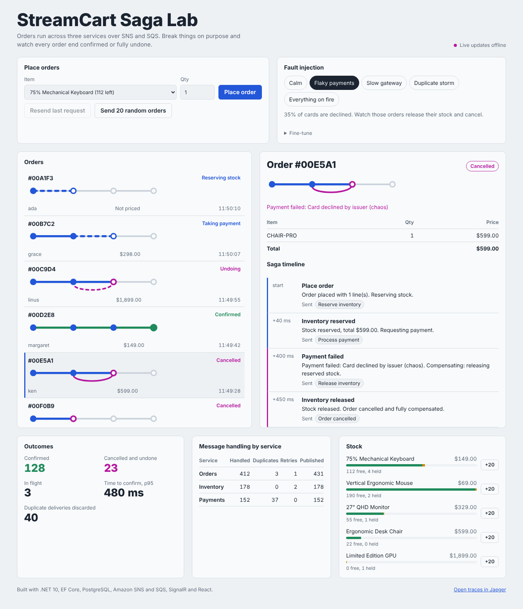
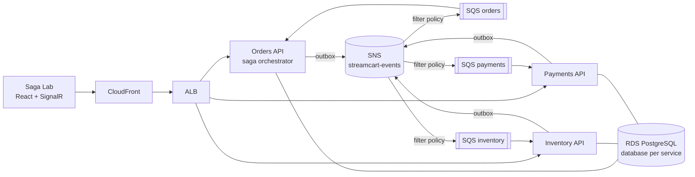
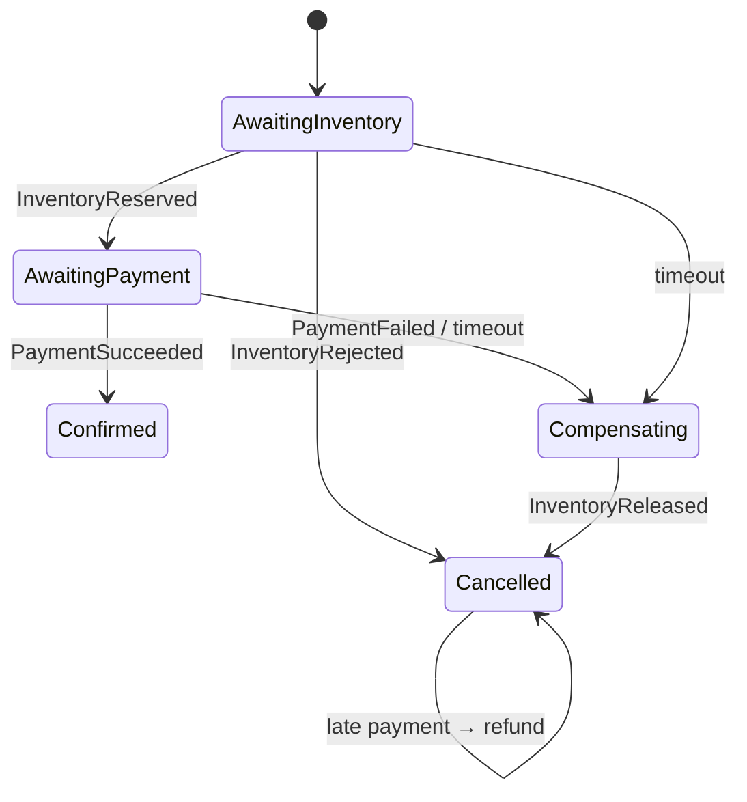

# StreamCart

**An event-driven order platform on .NET 10 and AWS that heals itself, with a built-in Chaos Lab to prove it.**

Orders flow through three microservices (Orders, Inventory, Payments) over Amazon SNS and SQS.
There are no distributed transactions: an orchestrated **saga** coordinates the work and
**compensates** when a step fails. The React dashboard lets you inject faults (declined cards,
a slow payment gateway, duplicate message delivery) and watch every order still end either
confirmed or fully undone, in real time.

[](https://github.com/YOUR-GITHUB-USERNAME/streamcart/actions/workflows/ci.yml)




Each order is drawn as a route: Placed → Stock → Payment → Confirmed. When something fails,
the line doubles back as the saga undoes its work.

---

## What this project demonstrates

| Problem in distributed systems | How StreamCart solves it |
|---|---|
| No ACID transactions across services | Orchestrated **saga** with compensating actions ([ADR-0001](docs/adr/0001-orchestrated-saga.md)) |
| Lost or phantom events when "save then publish" crashes halfway | **Transactional outbox** with `FOR UPDATE SKIP LOCKED` ([ADR-0002](docs/adr/0002-transactional-outbox-and-inbox.md)) |
| At-least-once delivery causes duplicates | **Transactional inbox**: effectively-once processing |
| Client retries create duplicate orders | **Idempotency keys** with request hashing (422 on key reuse with a different body) |
| A service never replies | **Saga timeouts** that trigger compensation |
| A payment succeeds after the order was cancelled | Automatic **refund** path |
| Messages arrive out of order | Saga as a **pure function** with exhaustive edge-case tests ([ADR-0004](docs/adr/0004-saga-as-pure-function.md)) |
| Two orders race for the last item | **Optimistic concurrency** on PostgreSQL `xmin` |
| Poison messages | Exponential back-off, **dead-letter queues**, CloudWatch alarms |
| "Where did this order get stuck?" | **OpenTelemetry** trace context carried inside every message, one trace across all services |

The full reliability matrix is in [docs/architecture.md](docs/architecture.md#reliability-layers).

## Architecture





More diagrams, including the message sequence, are in [docs/architecture.md](docs/architecture.md).

## Tech stack

- **Backend:** .NET 10, ASP.NET Core Minimal APIs, EF Core 10, PostgreSQL, SignalR
- **Messaging:** Amazon SNS + SQS (LocalStack locally), custom outbox/inbox
- **Frontend:** React 19, TypeScript, Vite
- **Cloud:** AWS CDK in C#: ECS Fargate, ALB, RDS, SNS, SQS + DLQs, CloudFront + S3, Secrets Manager, CloudWatch
- **Quality:** xUnit, Testcontainers, k6 load tests, GitHub Actions, Trivy image scanning, Dependabot
- **Observability:** OpenTelemetry, Jaeger, structured JSON logs

## Run it locally

You need Docker Desktop.

```bash
git clone https://github.com/YOUR-GITHUB-USERNAME/streamcart.git
cd streamcart
docker compose up --build
```

| What | Where |
|---|---|
| Saga Lab dashboard | http://localhost:8080 |
| Jaeger (distributed traces) | http://localhost:16686 |
| Orders / Inventory / Payments APIs | http://localhost:5101, :5102, :5103 (OpenAPI at `/openapi/v1.json`) |

### Try these scenarios

1. **Calm:** place an order. It confirms in well under a second. Open its timeline.
2. **Flaky payments:** send 20 random orders. About a third are declined; watch their routes
   double back as stock is released.
3. **Slow gateway:** place an order. Payment takes 20 s, the saga gives up at 15 s and
   compensates, then the late payment arrives and is **refunded automatically**.
4. **Duplicate storm:** send 20 orders. Payment messages are redelivered on purpose; the
   *Duplicates* column climbs while no customer is charged twice.
5. **Idempotency:** place an order, then press *Resend last request*. The API returns the same
   order instead of creating a second one.
6. **Stock-out:** order the *Limited Edition GPU* (3 in stock) a few times.
7. Open **Jaeger**, pick the `orders` service, and follow one order across all three services.

### Run services from your IDE instead

```bash
docker compose up postgres localstack jaeger      # infrastructure only
dotnet run --project src/Services/Orders/StreamCart.Orders.Api
dotnet run --project src/Services/Inventory/StreamCart.Inventory.Api
dotnet run --project src/Services/Payments/StreamCart.Payments.Api
cd frontend && npm install && npm run dev        # http://localhost:5173
```

## Tests

```bash
dotnet test tests/StreamCart.UnitTests            # saga, stock, payment and messaging rules
dotnet test tests/StreamCart.IntegrationTests     # real PostgreSQL via Testcontainers (needs Docker)
k6 run load/place-orders.js                        # load test with an idempotent-retry check
```

The unit tests cover every saga transition, including duplicates, timeouts, late replies and
out-of-order messages. Integration tests run the real API against PostgreSQL and verify the
outbox, idempotency and inbox de-duplication end to end.

## Deploy to AWS

The whole environment is one CDK stack written in C# ([infra/](infra/StreamCart.Infra/StreamCartStack.cs)).

```bash
npm install -g aws-cdk
cd frontend && npm ci && npm run build && cd ..
cd infra
cdk bootstrap        # once per account/region
cdk deploy           # prints DashboardUrl when finished
```

Or run the **Deploy to AWS** GitHub Actions workflow, which authenticates with GitHub OIDC
(no AWS keys stored in the repository). Set the `AWS_DEPLOY_ROLE_ARN` secret first.

**Cost:** about $3-4 per day while running (NAT gateway, ALB, RDS, three Fargate tasks).

### Tear down

```bash
cd infra && cdk destroy
```

## Project structure

```
src/
  BuildingBlocks/          shared messaging: envelope, outbox, inbox, SNS/SQS transport, telemetry
  Services/
    Orders/                saga orchestrator, idempotent API, timeout watcher, SignalR hub
    Inventory/             stock allocation, reservations with tombstones
    Payments/              payment rules, refunds, Chaos Lab fault injection
    Dockerfile             one multi-stage image definition for all services
frontend/                  Saga Lab dashboard (React + TypeScript)
infra/                     AWS CDK stack (C#)
tests/                     unit and integration tests
load/                      k6 load test
deploy/localstack/         local SNS/SQS topology, mirrors the CDK stack
docs/                      architecture and decision records
```

## Design decisions

Every significant trade-off is written down as an [Architecture Decision Record](docs/adr/README.md),
including what was rejected and why: Kafka vs SNS/SQS, Lambda vs Fargate, choreography vs
orchestration, and the scaling limits of the current design.

## Roadmap

- [ ] EF Core migrations checked in (currently `EnsureCreated`, see ADR-0005)
- [ ] Redis backplane so the Orders service can scale out (ADR-0006)
- [ ] Outbox/inbox retention job
- [ ] Notification service consuming `OrderConfirmed` / `OrderCancelled` (SES email)
- [ ] Chaos settings in AWS AppConfig so they apply across replicas

## License

MIT, see [LICENSE](LICENSE).
