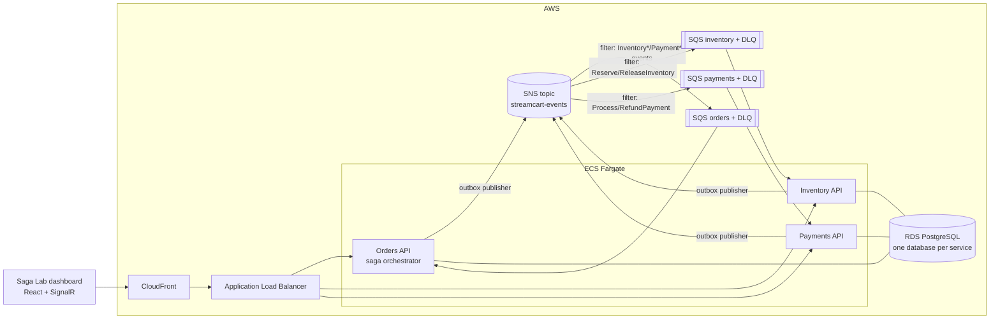
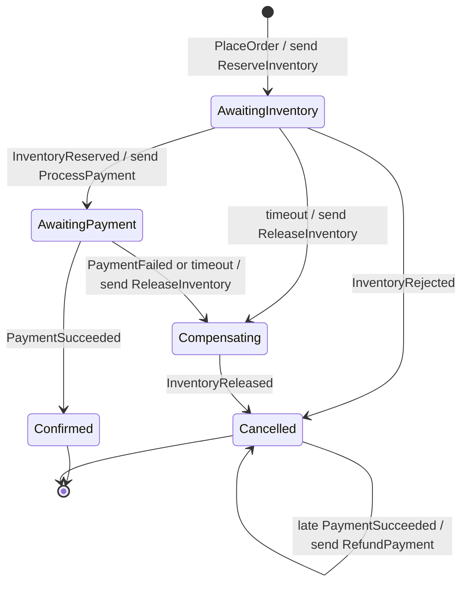
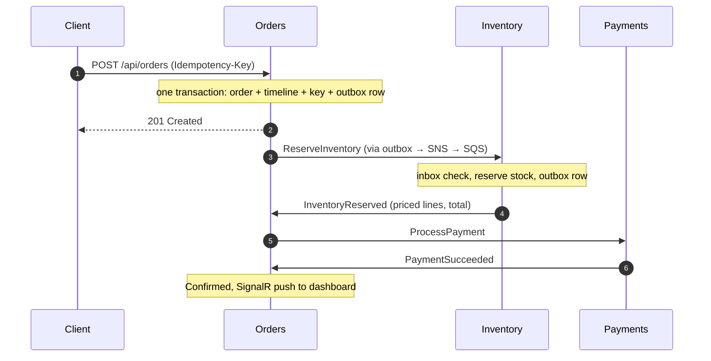

# Architecture

## Context

StreamCart takes an order through three independently deployed services. Each owns its
data; they communicate only through messages. There is no distributed transaction: the
**Orders** service orchestrates a saga and compensates when a step fails.

## The saga

The state machine is a pure function, `OrderSaga.Decide(state, message) -> decision`
([source](../src/Services/Orders/StreamCart.Orders.Api/Domain/OrderSaga.cs)). Handlers only
load state, call it, and persist the result, so every edge case is covered by
millisecond-fast unit tests.

## Happy path, message by message

## Reliability layers

| Failure | What protects the system | Where |
|---|---|---|
| Client retries a POST after a timeout | Idempotency key + request hash; replay returns the original order | `OrderEndpoints` |
| Service crashes after writing to the DB but before publishing | Transactional outbox; publisher retries | `OutboxPublisher` |
| SQS delivers a message twice | Transactional inbox keyed by message id + consumer | `IncomingMessageProcessor` |
| Two replicas publish the same outbox batch | `FOR UPDATE SKIP LOCKED` | `OutboxPublisher` |
| Two orders race for the last unit of stock | Optimistic concurrency on `xmin` | `Product.Version` |
| A step never answers | Saga timeout watcher compensates | `SagaTimeoutWatcher` |
| Payment succeeds after the order was cancelled | Saga issues `RefundPayment` | `OrderSaga` |
| `ReleaseInventory` overtakes `ReserveInventory` | Tombstone reservation refuses the late reserve | `ReleaseInventoryHandler` |
| A message can never be processed | Exponential visibility back-off, then DLQ + CloudWatch alarm | `SqsConsumer`, CDK stack |
| Double charge if every layer above failed | Unique index on `payments.OrderId` | `PaymentsDbContext` |

## Observability

Every message carries W3C `traceparent` in its envelope. The outbox publisher starts a
producer span and the consumer starts a consumer span with that parent, so one trace in
Jaeger (local) or any OTLP backend (AWS: ADOT collector to X-Ray) shows the HTTP request
and every hop through SNS and SQS across all three services. Logs are JSON in production,
with `MessageId`, `MessageType` and `OrderId` as scope fields for CloudWatch Logs Insights.
